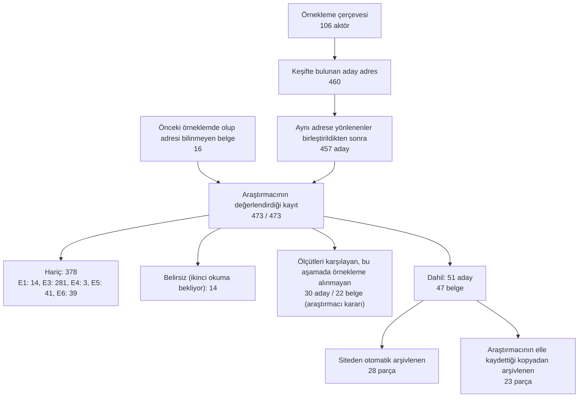

# Veri toplama akış şeması (PRISMA uyarlaması)

```mermaid
flowchart TD
  A["Örnekleme çerçevesi<br/>106 aktör"] --> B["Keşifte bulunan aday adres<br/>460"]
  B --> C["Aynı adrese yönlenenler birleştirildikten sonra<br/>457 aday"]
  T["Önceki örneklemde olup adresi bilinmeyen belge<br/>16"] --> D
  C --> D["Araştırmacının değerlendirdiği kayıt<br/>473 / 473"]
  D --> H["Hariç: 378<br/>E1: 14, E3: 281, E4: 3, E5: 41, E6: 39"]
  D --> U["Belirsiz (ikinci okuma bekliyor): 14"]
  D --> R["Ölçütleri karşılayan, bu aşamada örnekleme alınmayan<br/>30 aday / 22 belge (araştırmacı kararı)"]
  D --> I["Dahil: 51 aday<br/>47 belge"]
  I --> O["Siteden otomatik arşivlenen<br/>28 parça"]
  I --> M["Araştırmacının elle kaydettiği kopyadan arşivlenen<br/>23 parça"]
```

Üretim zamanı (UTC): 2026-10-10T15:36:27Z
